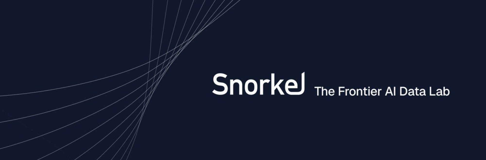

  

  
  
  

  

## Hey, I'm Omar

I'm a Cybersecurity student at the **University of South Florida**, a **Software Engineer at Snorkel AI**, a **Critical Infrastructure Analyst at Cyber Florida**, and an **AI Security researcher** in the NSF CISE REU program. I work where AI and security meet: I build agent tooling, attack models, and find bugs in real software.

Right now I'm especially interested in:

- adversarial attacks on AI systems, especially generative attacks on biometric authentication
- safe test harnesses for autonomous AI agents, including ICS / critical infrastructure environments
- orchestration for AI coding agents in Rust + TypeScript
- vulnerability research on open-source AI frameworks

## Featured Projects

| Project | Recognition | What it is |
| --- | --- | --- |
| [**Bubble Harness**](https://github.com/huslayer826/bubble-harness-1.0) | 🚀 **500+ users** | Rust/TypeScript desktop control plane that orchestrates parallel AI coding agents (Codex, Claude, OpenCode) with Git worktree isolation. |
| [**Spotted**](https://github.com/huslayer826/Spotted-HackABull2026) | 🥇 **1st place**, HackABull 2026 | AI camera security platform that detects theft in real time and triggers automated voice deterrence. |
| [**Raven**](https://github.com/huslayer826/Raven) | 🥈 **2nd place**, HackUSF 2026 | Sandboxed malware analysis with multi-agent triage, IOC extraction and enrichment, and threat classification. |
| [**Fragments**](https://github.com/huslayer826/Fragments) | 🏅 **4th place**, Hack The Bay 2026 | AI network security platform using ARP/Nmap scanning, device fingerprinting, CVE mapping, and RAG risk scoring. |

## Tech Stack

  

**Security:** CrowdStrike · Carbon Black · ThreatLocker · Gurucul SIEM · Nessus · NodeZero · Burp Suite · Metasploit · Nmap · Wireshark · Snort · Kali Linux

**AI tooling:** Claude Code · Codex · Cursor · Hugging Face · Diffusion / FLUX / LoRA

## Certifications

  
  
  
  
  

